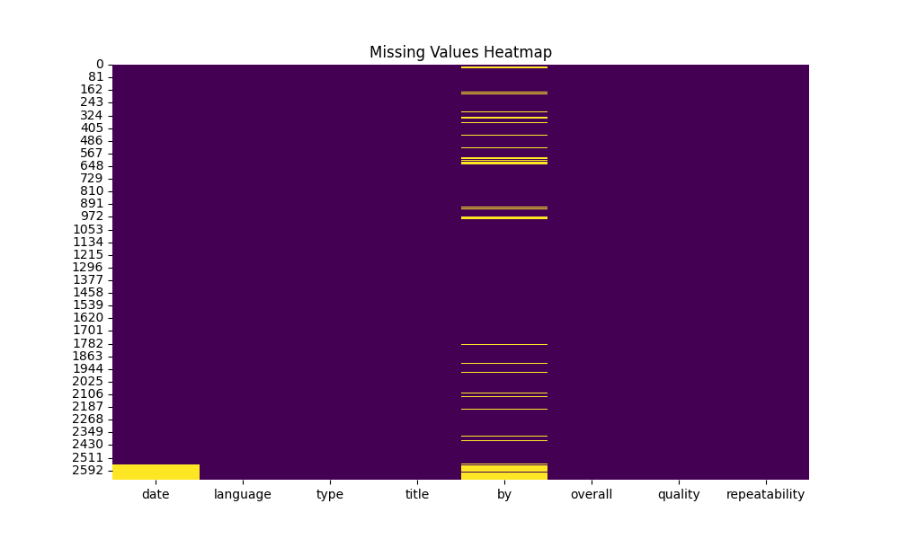
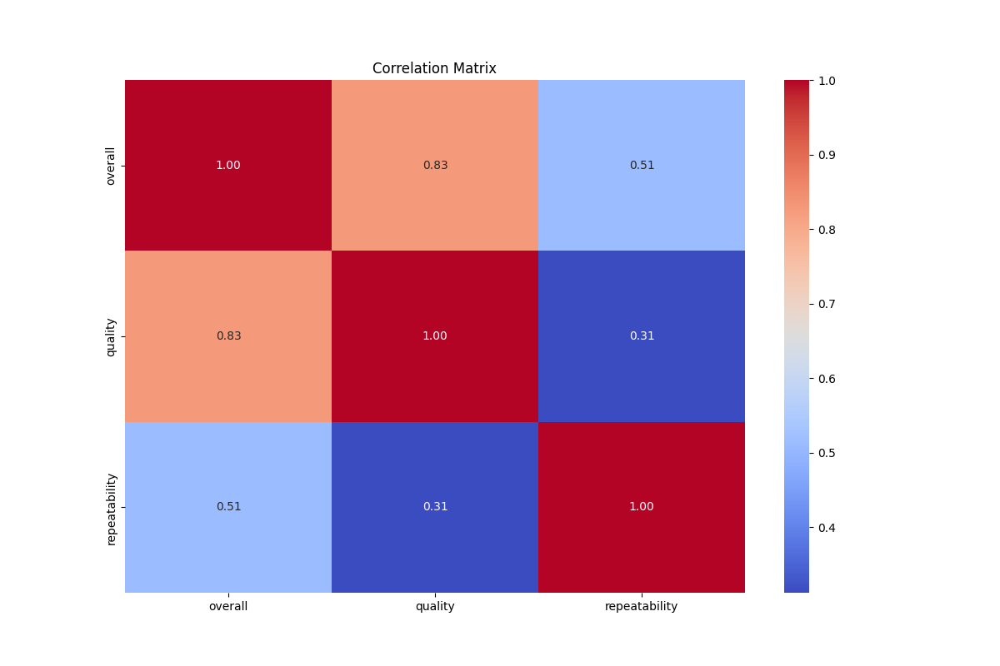

# Automated Analysis Report

## Data Summary
Shape: (2652, 8)
Columns: date, language, type, title, by, overall, quality, repeatability
Missing Values:
  - date: 99 missing values
  - language: 0 missing values
  - type: 0 missing values
  - title: 0 missing values
  - by: 262 missing values
  - overall: 0 missing values
  - quality: 0 missing values
  - repeatability: 0 missing values

Describe Statistics:
{
  "date": {
    "count": 2553,
    "unique": 2055,
    "top": "21-May-06",
    "freq": 8,
    "mean": NaN,
    "std": NaN,
    "min": NaN,
    "25%": NaN,
    "50%": NaN,
    "75%": NaN,
    "max": NaN
  },
  "language": {
    "count": 2652,
    "unique": 11,
    "top": "English",
    "freq": 1306,
    "mean": NaN,
    "std": NaN,
    "min": NaN,
    "25%": NaN,
    "50%": NaN,
    "75%": NaN,
    "max": NaN
  },
  "type": {
    "count": 2652,
    "unique": 8,
    "top": "movie",
    "freq": 2211,
    "mean": NaN,
    "std": NaN,
    "min": NaN,
    "25%": NaN,
    "50%": NaN,
    "75%": NaN,
    "max": NaN
  },
  "title": {
    "count": 2652,
    "unique": 2312,
    "top": "Kanda Naal Mudhal",
    "freq": 9,
    "mean": NaN,
    "std": NaN,
    "min": NaN,
    "25%": NaN,
    "50%": NaN,
    "75%": NaN,
    "max": NaN
  },
  "by": {
    "count": 2390,
    "unique": 1528,
    "top": "Kiefer Sutherland",
    "freq": 48,
    "mean": NaN,
    "std": NaN,
    "min": NaN,
    "25%": NaN,
    "50%": NaN,
    "75%": NaN,
    "max": NaN
  },
  "overall": {
    "count": 2652.0,
    "unique": NaN,
    "top": NaN,
    "freq": NaN,
    "mean": 3.0475113122171944,
    "std": 0.7621797580962717,
    "min": 1.0,
    "25%": 3.0,
    "50%": 3.0,
    "75%": 3.0,
    "max": 5.0
  },
  "quality": {
    "count": 2652.0,
    "unique": NaN,
    "top": NaN,
    "freq": NaN,
    "mean": 3.2092760180995477,
    "std": 0.7967426636666686,
    "min": 1.0,
    "25%": 3.0,
    "50%": 3.0,
    "75%": 4.0,
    "max": 5.0
  },
  "repeatability": {
    "count": 2652.0,
    "unique": NaN,
    "top": NaN,
    "freq": NaN,
    "mean": 1.4947209653092006,
    "std": 0.598289430580212,
    "min": 1.0,
    "25%": 1.0,
    "50%": 1.0,
    "75%": 2.0,
    "max": 3.0
  }
}

## LLM Insights
No insights provided.

## Visualizations

